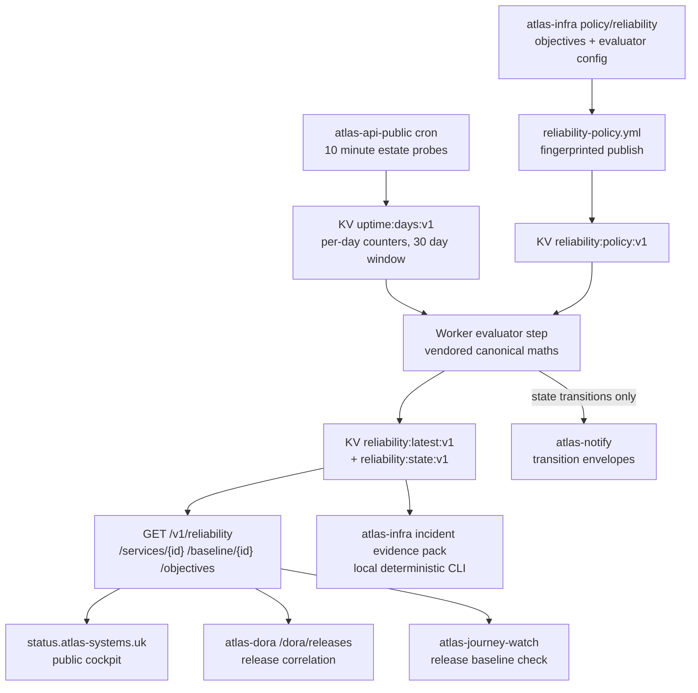

# Atlas reliability intelligence plan

Status: implemented alongside this document; every change ships as a draft pull request and nothing merges or deploys without owner review

Date: 19 July 2026

Owner: Atlas Reaper (`AtlasReaper311`)

Scope: turn the existing health, telemetry, journey, deployment, DORA, notification, evidence and status components into one coherent reliability-intelligence system without inventing history, duplicating policy ownership, or adding a paid service.

## 1. Current state, verified from the live checkout

Discovery was read-only and every claim below was verified against the working trees on 19 July 2026.

### 1.1 What is measured

- `atlas-api-public` probes 19 estate components every ten minutes from its cron and accrues per-day counters `{ok, total, ms_sum, ms_count}` per component into one KV document (`uptime:days:v1`), pruned past a rolling 30 day window. `measuring_since` records when accrual began. Probe round trips are recorded only for successful probes; failures are failure facts, not latency facts.
- `GET /v1/slo` serves those raw day buckets plus per-component aggregates (`ok`, `total`, `avg_ms`, `days_observed`, `first_day`) and the window metadata. It serves data, not verdicts.
- `atlas-notify` persists a 200-entry ring buffer of events (`notify:recent:v1`), including the `Deployed: <repo>` convention that `atlas-dora` already parses.
- `atlas-blackbox` seals bounded incident windows; `deploy-watch` records the latest Pages deploy; `github-pulse` exposes scheduled workflow conclusions used as evidence for `atlas-badges`, `atlas-dep-audit` and `atlas-journey-watch` health.
- Chaos assurance publishes `atlas-chaos-report-set/v1` documents with detection, notification, rollback and recovery latencies to `POST /v1/evidence/chaos/report`, authenticated by `EVIDENCE_REPORT_KEY` and fingerprint-verified. Estate conformance publishes the same way under `conformance`.

### 1.2 What is configured

- `status/slo.json` holds the only approved availability targets: ten services, each mapping a `service_id` to a probe component, a `target_pct` (99.5 and 99 for edge Workers, 75 for machine-domain services that sleep by design), a display label and an optional note.
- The status page computes error budget client-side from the raw counters and the static targets. It has documented honesty rules: partial windows are labelled, no data is never zero percent, and a blown budget renders as plainly as a healthy one.

### 1.3 What is derived

- `atlas-dora` computes deployment frequency, change failure rate and MTTR from the notify ring buffer, blackbox incidents and deploy-watch, using correlation heuristics that each response describes. It holds no secret and cannot send notifications by design.
- `atlas-journey-watch` release verification (`release-watch.mjs`) already consumes an `atlas-journey-watch/release-baseline/v1` document with baseline, observed values and thresholds. Its README states, and the checkout confirms, that no baseline producer exists anywhere; `baseline-comparison` is recorded as `unknown` and never blocks.

### 1.4 Confirmed architectural gaps

1. All 24 canonical service contracts have empty `slo_refs` arrays (verified across `policy/service-contracts/`).
2. The status page owns SLO targets and budget presentation; `atlas-api-public` owns raw counters; no component owns derived reliability results, burn rates, or freshness verdicts.
3. Per-day aggregate counters cannot produce percentiles or sub-day burn windows. Any design claiming a one-hour burn window from this data would be manufacturing precision. Windows must be day-granular.
4. Release evidence, DORA observations and probe history are not correlated anywhere.
5. Chaos evidence records recovery timings but contributes nothing to reliability reporting.
6. Health vocabularies differ across surfaces: probe components use `healthy, degraded, down, unknown`; control-plane contracts use `healthy, warning, failed, stale, unavailable, unknown`; release states use `pending, live, mismatch, degraded, failed, rolled-back, unknown`; the status page uses `operational, unreachable, timed out`.
7. `atlas-notify` performs no deduplication or cooldown; producers own transition detection. The quota cost guard already follows that pattern.
8. Open pull requests: `atlas-api-public` PR 5 (draft, Ramone control-plane tools) touches `src/index.js`, `src/openapi.js`, `src/meta.js` and `wrangler.toml`; PR 17 touches only generated inventory data. The reliability API work will conflict textually, not semantically, with PR 5; the merge order section covers this.

## 2. Requirements

### 2.1 Functional

1. Answer, from measured evidence only: which services meet their objectives, which are burning budget too quickly, which are healthy, degraded, stale, unavailable or unknown, whether a release improved or damaged reliability, which dependency is implicated, whether a regression followed a deployment, whether the owner was told once, which runbook applies, what evidence attaches to an incident, and what remains unmeasured.
2. Populate `slo_refs` only for the ten services with approved targets and measurable probe evidence. Every other service is explicitly unmeasured.
3. Derive error budget, day-granular burn rates, measurement coverage and freshness deterministically from the existing probe counters.
4. Correlate releases with before and after measurement windows, labelled as correlation and never causation.
5. Notify on meaningful state transitions only, deduplicated, cooled down, storm-suppressed, with runbook references.
6. Present the derived results publicly with honest stale and unavailable states.
7. Assemble a deterministic, schema-valid incident evidence pack on demand.

### 2.2 Non-functional

- Missing, expired, malformed or incomplete evidence must produce `unknown`, `stale`, `unavailable` or an explicit insufficiency state, never health.
- The core evaluator must run offline against fixtures with no socket. Identical inputs must produce byte-identical outputs.
- No new paid service, repository, secret value, provider scope or write surface on public routes.
- Additive evolution only: `/v1/slo`, the status page URL contract, `slo.json` availability, and every existing route keep working unchanged.
- All text follows estate prose rules: no em dash, no banned words, numbers below ten written as words in prose, no unfinished copy markers.

## 3. Ownership

| Concern | Owner | Supporting |
|---|---|---|
| Reliability objectives (targets, windows, freshness bounds, sample minima) | `atlas-infra` `policy/reliability/` | `status` consumes a generated projection |
| Objective and result contracts, evaluator reference implementation, shared test vectors | `atlas-infra` `contracts/v1/` and `scripts/` | all consumers |
| Runtime evaluation, derived results API, baseline endpoint, transition notifications | `atlas-api-public` | `atlas-notify` delivery |
| Release and reliability correlation | `atlas-dora` | `atlas-api-public` read surface |
| Post-release baseline verification | `atlas-journey-watch` | baseline served by `atlas-api-public` |
| Notification rendering and channel routing | `atlas-notify` | producers own transitions |
| Public cockpit | `status` | `atlas-api-public` |
| Incident evidence pack | `atlas-infra` | `atlas-blackbox`, `atlas-postmortem` conventions |
| Failure-mode assurance | `atlas-infra` fixtures and tests | repository-native suites |

Out of scope by rule: `atlas-cv` (archived), `simple-proxy` (deprecated, external-derived), `atlas-dep-audit` (excluded by the programme brief). No change to `atlas-blackbox`, `atlas-api-index`, `atlas-quota-watch` or `atlas-systems` is required; their surfaces are consumed read-only. `atlas-postmortem` remains unchanged because the evidence pack is itself the human-reviewable postmortem input its manual flow expects.

## 4. Source of truth decision

Reliability targets migrate from `status/slo.json` to `atlas-infra`, recorded in `docs/adrs/ADR-0002-reliability-objective-ownership.md`.

- Canonical: `atlas-infra/policy/reliability/objectives/<service_id>.json`, one file per measured service, each validating against the new `reliability-objective` contract. Initial content carries exactly the ten approved targets from `status/slo.json`; no target is invented and no target changes value.
- Canonical evaluator configuration: `atlas-infra/policy/reliability/evaluator-config.json` (windows, thresholds, sample minima, grace periods).
- Generated projection one: `status/slo.json` is regenerated deterministically by `scripts/reliability_policy.py emit-status-slo`. It keeps its existing shape and public URL so the page and any external consumer keep working, and gains `generated_from` and `policy_fingerprint` provenance fields. The status repository CI continues validating the shape; editing targets there is now a policy change in `atlas-infra` first.
- Published projection two: `scripts/reliability_policy.py emit-policy-document` renders one fingerprinted `atlas-reliability-policy/v1` document (objectives plus evaluator configuration). A hardened `reliability-policy.yml` workflow publishes it to `POST /v1/reliability/objectives/report` with the existing `EVIDENCE_REPORT_KEY`, following the exact conformance and chaos evidence pattern. The Worker never bundles targets, so no vendored policy copy can drift.

Two sources never coexist: the canonical files are the only editable form, both projections are deterministic renders with embedded fingerprints, and the atlas-infra test suite fails if a projection in the tree does not match its canonical source.

## 5. Data flow

`atlas-dora` reads `atlas-api-public`; `atlas-api-public` never reads `atlas-dora`; nothing reads the cockpit. There is no cycle.

## 6. Trust boundaries

| Boundary | Trusted side | Other side | Rule |
|---|---|---|---|
| Policy publish | atlas-infra workflow holding `EVIDENCE_REPORT_KEY` | public internet | Bearer auth, fingerprint verification, 512 KiB cap, schema check before storage |
| Public reliability reads | Worker and its KV | anonymous clients | Bounded responses, 60 second cache, rate limit, no evidence payload dereference, no write method |
| Notification send | Worker service binding to atlas-notify | Discord webhooks | Existing `NOTIFY_TOKEN` binding path; payloads carry no secret, no raw provider response |
| Correlation reads | atlas-dora | public API surfaces | Read-only public GETs; dora continues to hold zero secrets |
| Evidence pack | local operator CLI | local files | No network requirement, no secret fields permitted by schema, deterministic output |

All inputs to the pipeline are already public or already inside the estate's authenticated evidence path, so the public cockpit exposes aggregates of public data only. No private surface is required for safety; burn rates, correlation summaries, finding identifiers and runbook paths derive entirely from public measurements.

## 7. Contracts and data models

Three new versioned contracts join `contracts/v1/` (each with `$id`, `schema_version`, strict `additionalProperties`, bounded strings and collections, UTC RFC 3339 timestamps, embedded example, positive and negative fixtures, and no secret-bearing field):

1. `reliability-objective.schema.json`, `atlas-control-plane/reliability-objective/v1`: `objective_id`, `service_id`, indicator (`availability` now; `latency` admitted by vocabulary but unused until a latency target is approved), measurement source (`atlas-api-public/v1/slo` component name), window days, target percentage, freshness bound seconds, minimum sample counts, provenance (`approved-target-migration:status/slo.json`), display metadata.
2. `reliability-result.schema.json`, `atlas-control-plane/reliability-result/v1`: per-service results inside one estate document: observed availability, ok and failed sample counts, coverage fraction with numerator and denominator, average latency millis or null with reason, percentile latency explicitly null with reason (`per-day aggregates cannot support percentiles`), remaining error budget fraction, consumed fraction, fast and slow day-granular burn rates with their sample counts, reliability state, freshness state, confidence state, measurement start and end, evaluated timestamp, `stale_after`, source snapshot reference, policy fingerprint, result fingerprint.
3. `release-reliability-correlation.schema.json`, `atlas-control-plane/release-reliability-correlation/v1`: release identity (repository, deploy event timestamp, source), pre and post windows (day lists), availability delta, average latency delta, budget consumption delta, scheduled journey state at correlation time, verification availability statement, evidence sufficiency, `suspected_regression` boolean with explicit `correlation_not_causation: true`, confidence.

Reliability states (closed vocabulary, defined once in the objective contract's `$defs` and mapped to the existing six-value `ControlPlaneState`):

| Reliability state | Meaning | ControlPlaneState |
|---|---|---|
| `objective_met` | Budget remaining above risk thresholds with sufficient fresh samples | `healthy` |
| `budget_at_risk` | Fresh evidence shows fast burn at or above 2.0, slow burn at or above 1.5, or remaining budget at or below 25 percent | `warning` |
| `budget_exhausted` | Remaining budget at or below zero over the objective window | `failed` |
| `insufficient_evidence` | Fewer samples than the declared minima | `unknown` |
| `stale_evidence` | A previously valid result exists but `now` is past `stale_after` | `stale` |
| `unavailable_source` | Counters or policy missing or unreachable | `unavailable` |
| `malformed_evidence` | Counters fail structural validation (negative counts, ok above total, future days) | `unavailable` |
| `unmeasured` | No approved objective exists for the service | `unknown` |

A maintenance exclusion state exists in the vocabulary only when an approved maintenance declaration file is present; none ships now, so no code path can excuse an outage.

Local (non-cross-estate) schemas live beside their owner in `policy/schemas/`: `reliability-policy.schema.json` for the published policy envelope and `incident-evidence-pack.schema.json` for the pack.

## 8. Evaluator mathematics

All constants live in `evaluator-config.json`, not code.

- Window: the objective window is 30 days of UTC day buckets, bounded below by `measuring_since`.
- Availability: `ok / total` over buckets in the window. Failed samples are `total - ok`.
- Coverage: `total` divided by expected samples, where expected is 144 per elapsed UTC day since the later of window start and measurement start, capped at 1.0 and reported with numerator and denominator. Coverage below the configured floor (0.5) downgrades confidence to `low` and is reported, never hidden.
- Error budget: allowed failures are `total * (1 - target)`. Remaining budget fraction is `(allowed - failed) / allowed` when allowed is above zero; when a window has so few samples that allowed failures round below one, results carry `insufficient_evidence` instead of a fake precision verdict (minimum samples: 288, two full days of cadence).
- Burn rate: observed failure fraction in a short window divided by the allowed failure fraction `(1 - target)`. A burn rate of 1.0 consumes exactly the budget the window earns. Because source data is day-granular, the fast window is the two most recent UTC day buckets (today's partial plus yesterday) requiring at least 24 samples, and the slow window is the eight most recent buckets requiring at least 144 samples. Each burn rate reports its own sample count and is null with a reason below its minimum. These follow multi-window burn-rate principles at the resolution the evidence honestly supports; sub-day windows are impossible from per-day counters and are not claimed.
- Latency: average only, from `ms_sum / ms_count` over successful probes. Percentiles are structurally impossible from these aggregates and are always null with that reason.
- Freshness: results carry `evaluated_at` plus `stale_after` (evaluated time plus 30 minutes, three missed cron passes). Serving reads past `stale_after` marks the whole document `stale_evidence` while preserving last-known values, labelled. Policy in KV older than its declared `stale_after` (eight days against a weekly publish) makes every result `unavailable_source`; last-known results remain served as stale, never refreshed silently.
- Determinism: evaluation is a pure function of (policy document, counters document, `now`). The reference implementation is `scripts/reliability_evaluator.py` (stdlib only). Shared JSON test vectors under `tests/fixtures/reliability/vectors/` pin inputs and exact expected outputs; the runtime consumer in `atlas-api-public` vendors the same mathematics in `src/lib/reliability.js` and must reproduce the vectors byte-for-byte in its own suite. The vendoring pattern follows the estate's `_meta.js` precedent; the vectors, not the prose, are the compatibility contract.

## 9. Bounded reliability API

`atlas-api-public` remains the correct owner: the counters live in its KV, its cron already runs every ten minutes, and its evidence ingest pattern already solves authenticated fingerprinted publishing.

| Route | Method | Auth | Behaviour |
|---|---|---|---|
| `/v1/reliability` | GET | public | Estate reliability document: every measured service's result plus the explicit unmeasured list; cache 60 seconds; bounded below 64 KiB |
| `/v1/reliability/services/{service_id}` | GET | public | One service result; 404 for unknown ids; `unmeasured` state for known contract ids without objectives |
| `/v1/reliability/baseline/{service_id}` | GET | public | An `atlas-journey-watch/release-baseline/v1` document derived from measured history (average latency variant), `stale_after` 30 minutes; 503-shaped honest unavailability when evidence is insufficient |
| `/v1/reliability/objectives` | GET | public | The active policy document summary (targets are already public on the status page) |
| `/v1/reliability/objectives/report` | POST | `EVIDENCE_REPORT_KEY` | Fingerprint-verified policy ingest, mirroring the evidence route exactly; 512 KiB cap |

Rules carried over from the existing surface: rate limiting through `RL_GENERAL`, JSON schema documented in OpenAPI, `/_meta` endpoint list updated, five second internal budgets, no write method besides the authenticated policy ingest, no raw evidence dereference, no provider credential anywhere. When no evaluation has ever run, GETs return an honest `503` with the producing precondition named, exactly as `/v1/evidence` does today. `/v1/slo` is untouched.

## 10. Release correlation

`atlas-dora` gains `GET /dora/releases`: for each deploy event already detected in the ring buffer, it derives pre-release and post-release windows from `/v1/slo` day buckets. The release day itself is excluded as mixed; pre is up to three full days before, post is up to three full days after, and evidence sufficiency states how much of each exists. Deltas cover availability, average latency and budget consumption rate. `suspected_regression` requires post-window availability below the pre-window by more than the configured threshold with both windows at or above minimum samples. Every response carries `correlation_not_causation: true` and the basis, matching dora's existing honesty convention. A release with no post-release evidence is `insufficient_evidence`, never safe. Existing DORA metric definitions, routes and KV behaviour do not change.

Post-release verification: `atlas-journey-watch` release-watch already consumes a baseline file. The additive change accepts a variant carrying `latency_ms_avg` beside the existing `latency_ms_p95` (exactly one required), because average latency is what the estate can honestly measure today. The release workflow gains an optional step fetching `/v1/reliability/baseline/{service_id}`; a fetch failure records `baseline-comparison: unknown` exactly as today. No rollback automation exists anywhere in this design.

## 11. Notification design

The producer is the runtime evaluator in `atlas-api-public`, which already holds the `ATLAS_NOTIFY` service binding. `reliability:state:v1` in KV records, per service and objective: current state, entered-at, last notification per dedup key, and pending-recovery marker.

Transitions that notify: `objective_met` to `budget_at_risk`; `budget_at_risk` to `budget_exhausted`; any measured state to `stale_evidence`; `unavailable_source` persisting beyond its grace period; recovery to `objective_met` only after the recovered state has held for six consecutive passes (one hour of measured evidence). Post-release regression notification stays with the journey-watch release workflow, which already notifies on failed verification; no second producer duplicates it.

Envelope rules: source `reliability`, level mapped from severity, stable dedup key `reliability:<service_id>:<objective_id>:<from>-><to>:<utc_day>`, cooldown six hours per key, bounded fields (service, objective, transition, remaining budget, burn rates with sample counts, window, `evaluated_at`, `runbook_ref`), no secret, no raw provider payload. Storm suppression: when five or more services transition in one pass, one consolidated envelope lists them (bounded to ten, with a count) and per-service sends are suppressed with an explicit `suppressed: true` marker recorded in state. `atlas-notify` gains a `reliability` signal class (one routing entry, degrading to the default webhook when unconfigured) and one formatter. Development and validation use fixtures and stubbed delivery only; no live notification is sent by any test.

## 12. Cockpit

The status page's service-levels section switches its calculation authority to `GET /v1/reliability` while keeping `slo.json` as row configuration (labels, notes, ordering). New rendering: measurement coverage, current state, last measured time, day-granular burn indicators, and honest `stale` and `unavailable` presentations that keep last-known numbers on screen, labelled, per the page's existing rules. The pure calculation and formatting functions move to `js/reliability.js` with a `node --test` suite covering every state, malformed payloads and the stale path; CI gains that test step. Semantic structure keeps the existing list layout with headers, adds `aria-live` on the updating region, keyboard-reachable details, and the existing palette (contrast-checked against WCAG 2.1 AA on the dark background). No other page section changes.

## 13. Incident evidence pack

`scripts/incident_evidence_pack.py` in `atlas-infra` assembles, from local file inputs only, a deterministic `atlas-incident-evidence-pack/v1` document linking: affected service and objective, first detected time, last healthy evidence, burn-rate transition history, related release event, journey failure reference, notification evidence, recovery evidence, runbook reference, DORA correlation reference and chaos experiment identifier when one applies. References are stable paths and fingerprints, never embedded payloads. The pack validates against `policy/schemas/incident-evidence-pack.schema.json`, is fingerprinted with the estate's canonical JSON rules, and is ingestible by the existing evidence ledger under its already-allowed `incident` kind. Nothing creates incidents automatically and nothing writes to external systems.

## 14. Failure-state assurance

Fixture-only tests in `atlas-infra` (evaluator and pack) and the consumer suites cover: stale counters, missing counters, malformed counters (negative, ok above total, future day keys, non-object buckets), counter reset shapes, insufficient samples, latency spike with valid samples, partial dependency failure (one component missing), broad outage (storm suppression), release with no post evidence, release followed by regression, recovery after regression, duplicated events, out-of-order days, clock skew (`measuring_since` in the future), unsupported service ids, deprecated and archived service exclusion (objectives for them are policy validation errors), and public API upstream failure (missing KV documents). No live probe, KV mutation, DNS, secret, route, Worker, deployment or notification is touched by any test.

## 15. Repository and file-level change plan

| Repository / branch | Files |
|---|---|
| `atlas-infra` / `feat/reliability-contracts` | this plan; `docs/adrs/ADR-0002-reliability-objective-ownership.md`; `docs/reliability-intelligence.md`; three runbooks under `docs/runbooks/`; `contracts/v1/reliability-objective.schema.json`, `reliability-result.schema.json`, `release-reliability-correlation.schema.json` plus fixtures and manifest entries and the `EXPECTED_SCHEMAS` update; `policy/reliability/evaluator-config.json` and `policy/reliability/objectives/*.json` (ten files); `policy/schemas/reliability-policy.schema.json`, `policy/schemas/incident-evidence-pack.schema.json`; `slo_refs` population in ten service contracts; runbook index and routing entries; `scripts/reliability_policy.py`, `scripts/reliability_evaluator.py`, `scripts/incident_evidence_pack.py`; extended `scripts/publish_evidence.py`; `scripts/tests/test_reliability_policy.py`, `test_reliability_evaluator.py`, `test_incident_evidence_pack.py`; shared vectors under `tests/fixtures/reliability/vectors/`; `.github/workflows/reliability-policy.yml` |
| `atlas-api-public` / `feat/reliability-api` | `src/lib/reliability.js`; `src/routes/reliability.js`; `src/cron.js` evaluation step; `src/meta.js`, `src/openapi.js`; `test/reliability.test.js` with copied parity vectors; README and runbook note |
| `atlas-notify` / `feat/reliability-notifications` | `src/index.js` signal class and formatter; tests; README |
| `atlas-dora` / `feat/release-reliability` | `src/release-reliability.js`; `src/upstream.js` slo fetch; `src/index.js` route; `test/release-reliability.test.js`; README |
| `atlas-journey-watch` / `feat/reliability-baseline` | `scripts/release-watch.mjs` additive baseline variant; fixtures and unit tests; workflow baseline fetch step; README |
| `status` / `feat/reliability-cockpit` | `index.html`; `js/reliability.js`; `slo.json` regenerated with provenance; `test/reliability.test.mjs`; `ci.yml` test step; README |

## 16. Alternatives considered

- Keeping `status/slo.json` canonical: rejected because `slo_refs` are atlas-infra-relative contract paths, the evaluator needs objectives beside policy, and a presentation repository owning estate policy inverts the established ownership model.
- Evaluating in a scheduled GitHub Action and publishing results: rejected on cost and freshness; ten-minute freshness from Actions would cost roughly 4,300 runner minutes a month against a 430 minute budget, while the Worker cron already runs at that cadence beside the data.
- Bundling objectives into the Worker at build time: rejected because it creates a second editable copy; the fingerprinted publish path already exists and fails closed.
- Sub-day burn windows: rejected as dishonest against per-day aggregates.
- A p95 latency baseline for release verification: rejected because percentiles cannot be derived from `ms_sum/ms_count`; the additive average-latency variant states what is actually measured.
- Notifying regressions from `atlas-dora`: rejected because dora deliberately holds no secret and gaining one would weaken its zero-credential design; journey-watch's existing failure notification covers the regression path.
- A new repository: not needed; every capability lands inside an existing owner.

## 17. Rollback strategy

Every change is a draft PR; before merge, rollback is closing the PR. After a merge and deploy, per repository:

- `atlas-infra`: revert the merge commit; policy files are inert data and the workflow is manually dispatched or weekly, so reverting stops future publishes; the Worker then ages the policy to `unavailable_source` within its grace period and reports honestly.
- `atlas-api-public`: revert and redeploy; `/v1/reliability*` routes disappear, `/v1/slo` and every existing route are untouched because the change is additive; KV keys become orphaned data that the next deploy of the revert ignores and can be deleted manually later.
- `atlas-notify`: revert and redeploy; the `reliability` class falls back to the unknown-source warning path, which still delivers visibly.
- `atlas-dora`, `atlas-journey-watch`: revert and redeploy or re-run; both changes are additive routes or optional inputs.
- `status`: revert and redeploy Pages; the previous page computed budgets client-side and continues working against the untouched `/v1/slo`.

## 18. Testing strategy and merge order

Per-repository validation before each PR: repository-native lint, unit tests, type checks and dry-run builds (`npm run lint`, `npm test`, `wrangler deploy --dry-run` for Workers; `python3 -m unittest discover -s scripts/tests` plus the contract validators for `atlas-infra`; `html-validate`, the slo contract check and `node --test` for `status`; `npm run check`, `test:unit` and `test:offline` for journey-watch), plus schema positive and negative fixtures, determinism double-runs, `git diff --check`, and prose rule scans over changed files.

Safe merge order, with the reason each step is safe:

1. `atlas-infra`: contracts and policy are inert data plus scripts; nothing consumes them yet.
2. `atlas-notify`: the new formatter is unreachable until a producer sends the class; a deploy before producers exist changes nothing visible.
3. `atlas-api-public`: routes appear and report honest unavailability until the first policy publish and evaluation pass; existing routes unchanged. After merge, dispatch `reliability-policy.yml` once.
4. `atlas-dora`: consumes `/v1/slo` (already live) and objectives (live after step 3).
5. `atlas-journey-watch`: baseline fetch degrades to today's `unknown` until step 3 serves baselines.
6. `status`: last, because its section renders derived results; merging earlier shows the honest unavailable state rather than breaking.

PR 5 in `atlas-api-public` (draft) shares files with step 3. Whichever merges second rebases mechanically: the collisions are route-table insertions in `src/index.js`, endpoint list entries in `src/meta.js` and path additions in `src/openapi.js`, verified in advance with `git merge-tree`.
